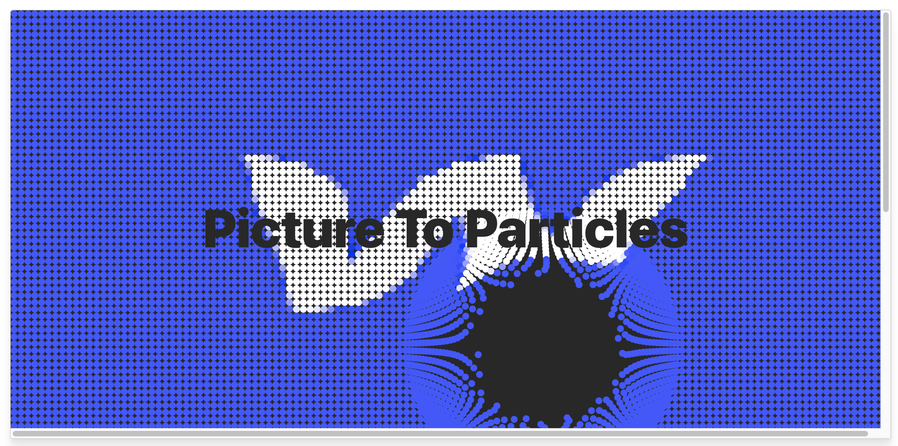
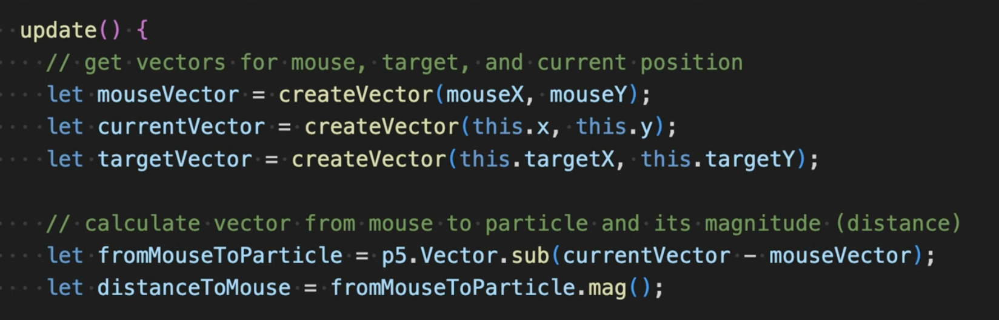
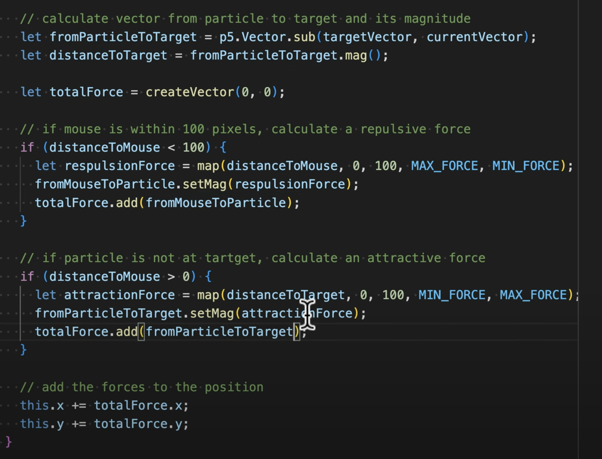

# slia0889_quiz_8

**Imaging Technique Inspiration**  

This is an interactive installation. Users can interact with the particles on the screen by moving their palms. During the experience, the user feels as if he can manipulate water and fire. I hope to use this technology in my future projects. Because particle interaction can provide a richer interactive experience for the user. Users can feel that their actions directly affect the elements on the page, thus increasing their involvement and engagement. Users may become interested in playing with the particles or observing their movements, thus increasing their enjoyment of the project.  

[Inspiration Artwork](https://www.behance.net/gallery/91186295/Arkhe?tracking_source=search_projects|creative+coding&l=40)
  

**Coding Technique Exploration**  

[Coding Technique Source](https://www.youtube.com/watch?v=_gz8FMduwRc)

The following code is to convert an image into an interactive particle system using p5.js. First, we need to create a particle and then use a for loop to generate multiple particles. After that we need to set the size of the particles and the resolution of the image, we need to set the color of the particles to get color by image so that they blend in with the background. After that, we need to read the mouse vector and calculate the distance from the mouse to the particle. At the same time, we need to calculate the vector of the particles that are hovered over by the mouse. The last step is to repulse particles from mouse to realize the effect of particles interacting with mouse.  

